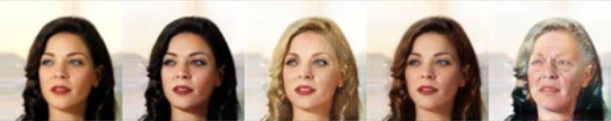
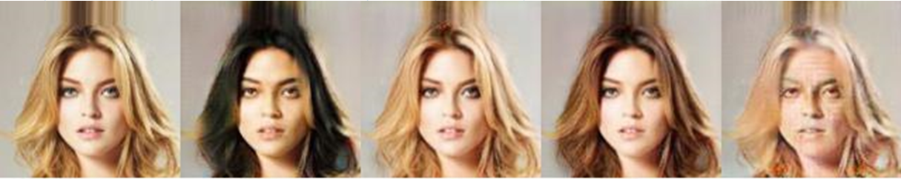

# DLIM2020

## Preview

Here you get a little teaser of what you can reproduce using the default settings.


## Description
An exploration of attribute-based face manipulation, using a pre-existing network structure as shown further below. The goal is that given an input image  of a face, the network should generate an image of the same face while only changing an attribute such as hair color, gender, age, etc.

## Dependencies

* [Python 3.5+](https://www.continuum.io/downloads)
* [PyTorch 0.4.0+](http://pytorch.org/)
* [TensorFlow 1.3+](https://www.tensorflow.org/) (optional for tensorboard)
_Note: Make sure you install the GPU version of Tensorflow (for versions 1.5+)_

We suggest using Anaconda for running this project. 
## Source 

For this project, we used the original version of the StarGAN network. If you want to have a look at it, it is also available on Github via the following link:

https://github.com/yunjey/StarGAN.git

_Note: A newer version of StarGAN with some cool additions has already been published. If you wish to view that instead, click [here](https://github.com/clovaai/stargan-v2)._


## Dataset
For training our network, we used one of the datasets from the original paper - the CelebA dataset. It consists of over 200000 celebrity images labelled with 40 different attributes.
If you want to download the dataset to train your own network with, run the following command: 
```bash
bash download.sh celeba
```
## Setup
After you have cloned the repository to your hard drive, you can either train a new network, or test using an existing network. Either way, make sure you activate your conda environment before proceeding.

### Training your own Network
Before training your network, make sure you have followed the instructions given in the DLIM OneDrive for setting up the cluster (i.e installing conda and setting up SLURM).
If you want to train your own network, you will first need to download an appropriate dataset. We suggest using the CelebA dataset. 

If you want to train the network using the baseline StarGAN network, navigate into the StarGAN folder and run the command:
```
sbatch submit.sh
```
In addition to the baseline that's available in this project, we have also implemented a modified network where we replaced the depthwise concatenation of attributes with lookup tables for our instance normalization layers. 
Similarly to before, navigate into the StarGAN_new_IN folder and run the same command as before:

```bash
sbatch submit.sh
```
**Changing Network Parameters**
If you want to play around with different learning rates, batch sizes or if you just want to train the network on other attributes, open the submit.sh file inside either of the network directories. If you want to change the number of training attributes, make sure you also change c_dim to reflect that (i.e 7 attributes means c_dim = 7)
For a full list of available parameters, open either `main.py`
For a full list of available training attributes, navigate into either jpg directory and open `CelebA.md`
*Please note that with the way the new instance normalization works, the list of training attributes needs to be mutually exclusive (i.e only one of the attributes in the list applies to each picture)*

### Run a pre-trained Network

To run one of the models that we've trained, navigate to the root directory and enter the command:
```
bash download.sh models
```

Alternatively, the models are also available to download [here:](https://www.dropbox.com/s/fgc5wnql9o7u3sd/Models.zip?dl=0)

After you have downloaded the models, navigate into the wanted model directory and copy both .ckpt files into `[Choose StarGAN]/stargan_celeba/models`. 

Since the network is already trained, it is not necessary to run the code on the cluster. Therefore, simply enter the command

```bash
python -u main.py "$@" --mode test --dataset CelebA --image_size 128 
               --sample_dir stargan_celeba/samples --log_dir stargan_celeba/logs \
               --model_save_dir stargan_celeba/models --result_dir stargan_celeba/results \
               --celeba_image_dir ../Datasets/celeba/images \
               --attr_path ../Datasets/celeba/list_attr_celeba.txt\
               --selected_attrs Black_Hair Blond_Hair Brown_Hair Male Young --c_dim 5         
```

For StarGAN with different instance normalization, you need to change the attributes so that they are mutually exclusive. There are a few available combinations such as male/female, or beard/no beard. We have trained our models with hair color, so if you wish to let it run, change the last line to 

```bash
--selected_attrs Black_Hair Blond_Hair Brown_Hair Gray_Hair --c_dim 4
```

Your results will be saved into `[Choose StarGAN]/stargan_celeba/result`.

## Analysis of our training sets

In this section we will talk about some of our results and possible interpretations of the data. 

To start, let's have a look at the default training configuration. We only changed the attributes that the network trained on while keeping all the parameters identical. We can see that some of our results look very well trained. There are some exceptions, however. 

 

Since some attributes might be more prevalent on one gender than the other, in which case our model occasionally tends to also apply some other changes that are undesirable. Here are some of the observations we made:


#### Attributes

**Black and brown hair**

 

The translation to black and brown hair went exceptionally well in most cases. In some of the pictures, the difference between the generated picture and the original is almost undiscernible. 


**Blonde and grey hair** 

 

Blonde and grey hair, however, come with some noticeable "errors":
Translation to blonde hair not only changed the hair color, it also lightened up the skin color of the target person and made their lips both redder and fuller. We suggest that the reason for this may be a slight bias in training data, with a larger part of the blonde hair pictures being from women. That way, during learning it may have also picked up on other trends, such as the make up or their, on average, lighter skin color. 
A similar thing happened with translation to grey hair, where the face of the person is also made older in addition to changing the hair color. The person receives wrinkles, and it also tends to make their eyes slightly smaller. We believe the cause for this might be that a majority of grey hair pictures is from people of higher age. 


**Baldness**

 

When translating images of bald people, the network attempts to give them hair as well. This results in some very amusing pictures. 


**Impact of Image Corruption**

 

Sometimes, the generated pictures become corrupted while being processed by the dataloader. In such cases, the network is unable to distinguish between the corruption and the "real" part of the images. For hair color translation, this also results in color changes in the corrupted areas of the image.


**Impact of Accessories**

 

When translating pictures with more visible accessories, such as a hat, it applies changes very similar to the ones where the person is not wearing any. In the case of the hat, this also results in its color getting changed to the target hair color in our tests. 


#### Network Parameters


<!--- Batchsize-->

 

We also compared between different batchsizes. Like you see in the images (below or up) that the training effect got worser if we increased the sizes. We got the best results with size 8. It by increasing the number of samples

<!--- Discriminator learning rate -->

 


We saw some interesting effects with increasing and decreasing the learningrate of the discriminator. We set the learning rate of the generator like it was before and started to play around with the just one parameter. First we increased the discriminator in the hope that it will get better in identifying the fake images the generator produced. But we underestimated the impact of the setting the learningrate 5 times higher (d_learningrate=0.0005 & g_learningrate=0.0001). We thought the backpropagation will get a better for the discriminator but never that thought it will increase that much. Like in the image you are watching above. This image is produced after 200k iterations.

 

Like increasing we also decreased and saw after some iteration that the evolving process was small.(d_learningrate=0.00001 & g_learningrate=0.0001) after 200k iteration again.

<!--- Generator learning rate -->


<!--- Hingeloss -->


<!--- instancenorm -->


<!--- Discriminator learning rate -->


## Testing with the same dataset

<!--- Some comments to tests between the tests-->
We also was able to manage to compare the different trained models on the same dataset. So we can compare different training results with each other.

<!--- default for comparison between all of them -->

<!--- four images next to each other for the different batchsize and a gif -->

<!--- four images next to each other for the different learning rate -->

<!--- four images next to each other for the different hingeloss instancenorm and default (wasserstein)-->


## Using a webcam as input to the neural network
using the opencv library to recognize a face, crop it, resize and feed it to the neural network

## Some results

 \
In the following Gif you get a idea of how the system is evolving through these 200000 iterations. Each images is made after 1000 iterations. We choose here a batchsize of 8 and the attributes black hair, blond hair, brown hair, male and young (from left to right, where the first image is the input.)

 \
Here you see a really bad result of the training. We set the learning rate for the discriminator 50-times higher than the one for the generator. We concluded that the discriminator performing way better than the generator and you see it in the short gif.


## Acknowledgements

This work is just for study purpose. We were a group of three electrical engineer which are doing this just for fun

##
