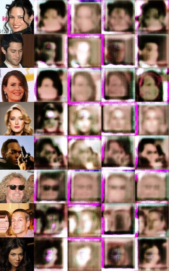
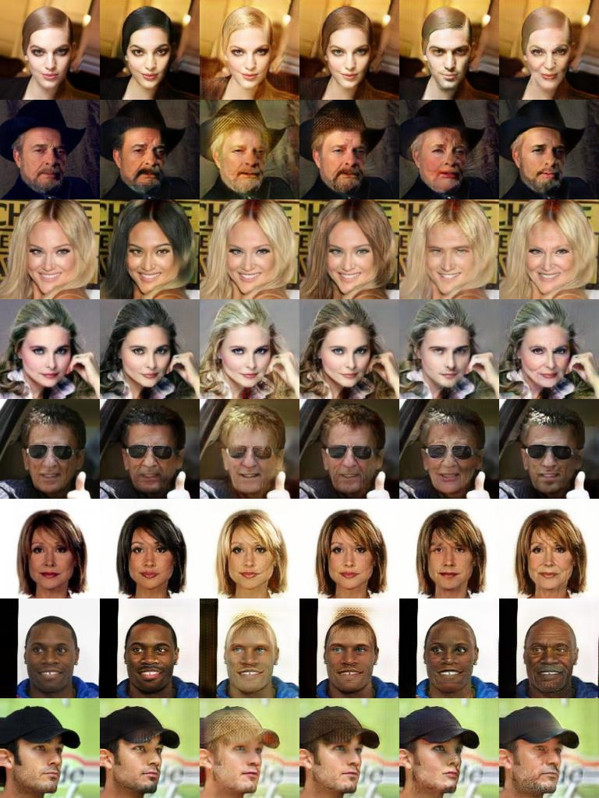

# DLIM2020

## Preview

Here you get a little teaser of what you can reproduce using the default settings.


## Introduction

Image-to-Image translation is a field that has gained lots of traction in the recent years. In this project, we explore a pre-existing network structure for attribute-based face manipulation.  The goal is that given an input image  of a face, the network should generate an image of the same face while only changing an attribute such as hair color, gender, age, etc.

Existing approaches have limited scalability and robustness for translation between more than two domains, since different models need to be built for every pair of image domains. Existing models are both inefficient and ineffective in multidomain image to image translation task. Their inefficiency results from the fact that in order to learn all mappings among k domains k(k-1) generators have to be trained. Each generator cannot fully use the training data and can only learn from two domains at a time out of k domains.

Furthermore, they are incapable of jointly training domains from different datasets , because each dataset is only partially labeled. In the case of CelebA and RaFD, while the former contains labels for attributes such as hair color and gender, it does not have any labels for facial expressions such as happy and angry and vice versa for the latter.

## Background

StarGAN can learn mappings among multiple domains and by consequence learns the mappings between all available domains. The input of the StarGAN network is an image and domain information and learns to flexibly translate the image into the corresponding domain. During the training we randomly generate a target domain label and train the model to flexibly translate the image into any desired domain at testing phase.

To overcome the current model problem with multiple datasets, a mask vector was added to the domain label. This ensures that the model ignores unknown labels and focus on the labels provided by a particular dataset, thus overcoming the problem of partially labeled datasets.

A unified version of the label as a vector is represented as  , where  represents a vector for the labels for the i-th dataset and m is the mask vector that allows StarGAN to ignore unspecified labels and focus only on the known ones.

## Dependencies

* [Python 3.5+](https://www.continuum.io/downloads)
* [PyTorch 0.4.0+](http://pytorch.org/)
* [TensorFlow 1.3+](https://www.tensorflow.org/) (optional for tensorboard)
_Note: Make sure you install the GPU version of Tensorflow (for versions 1.5+)_

We suggest using Anaconda for running this project. 
## Source 

For this project, we used the original version of the StarGAN network. If you want to have a look at it, it is also available on Github via the following link:

https://github.com/yunjey/StarGAN.git

_Note: A newer version of StarGAN with some cool additions has already been published. If you wish to view that instead, click [here](https://github.com/clovaai/stargan-v2)._


## Dataset
For training our network, we used one of the datasets from the original paper - the CelebA dataset. It consists of over 200000 celebrity images labelled with 40 different attributes.
If you want to download the dataset to train your own network with, run the following command: 
```bash
bash download.sh celeba
```
## Setup
After you have cloned the repository to your hard drive, you can either train a new network, or test using an existing network. Either way, make sure you activate your conda environment before proceeding.

### Training your own Network
Before training your network, make sure you have followed the instructions given in the DLIM OneDrive for setting up the cluster (i.e installing conda and setting up SLURM).
If you want to train your own network, you will first need to download an appropriate dataset. We suggest using the CelebA dataset. 

If you want to train the network using the baseline StarGAN network, navigate into the StarGAN folder and run the command:
```
sbatch submit.sh
```
In addition to the baseline that's available in this project, we have also implemented a modified network where we replaced the depthwise concatenation of attributes with lookup tables for our instance normalization layers. 
Similarly to before, navigate into the StarGAN_new_IN folder and run the same command as before:

```bash
sbatch submit.sh
```
**Changing Network Parameters**
If you want to play around with different learning rates, batch sizes or if you just want to train the network on other attributes, open the submit.sh file inside either of the network directories. If you want to change the number of training attributes, make sure you also change c_dim to reflect that (i.e 7 attributes means c_dim = 7)
For a full list of available parameters, open either `main.py`
For a full list of available training attributes, navigate into either jpg directory and open `CelebA.md`
*Please note that with the way the new instance normalization works, the list of training attributes needs to be mutually exclusive (i.e only one of the attributes in the list applies to each picture)*

### Run a pre-trained Network

To run one of the models that we've trained, navigate to the root directory and enter the command:
```
bash download.sh models
```

Alternatively, the models are also available to download [here:](https://www.dropbox.com/s/fgc5wnql9o7u3sd/Models.zip?dl=0)

After you have downloaded the models, navigate into the wanted model directory and copy both .ckpt files into `[Choose StarGAN]/stargan_celeba/models`. 

Since the network is already trained, it is not necessary to run the code on the cluster. Therefore, simply enter the command

```bash
python -u main.py "$@" --mode test --dataset CelebA --image_size 128 
               --sample_dir stargan_celeba/samples --log_dir stargan_celeba/logs \
               --model_save_dir stargan_celeba/models --result_dir stargan_celeba/results \
               --celeba_image_dir ../Datasets/celeba/images \
               --attr_path ../Datasets/celeba/list_attr_celeba.txt\
               --selected_attrs Black_Hair Blond_Hair Brown_Hair Male Young --c_dim 5         
```

For StarGAN with different instance normalization, you need to change the attributes so that they are mutually exclusive. There are a few available combinations such as male/female, or beard/no beard. We have trained our models with hair color, so if you wish to let it run, change the last line to 

```bash
--selected_attrs Black_Hair Blond_Hair Brown_Hair Gray_Hair --c_dim 4
```

Your results will be saved into `[Choose StarGAN]/stargan_celeba/result`.

## Analysis of our training sets

In this section we will talk about some of our results and possible interpretations of the data.

To start, let's have a look at the default training configuration. We only changed the attributes that the network trained on while keeping all the parameters identical. We can see that some of our results look very well trained. There are some exceptions, however. 

 

Since some attributes might be more prevalent on one gender than the other, in which case our model occasionally tends to also apply some other changes that are undesirable. Here are some of the observations we made:


#### Attributes

**Black and brown hair**

 

The translation to black and brown hair went exceptionally well in most cases. In some of the pictures, the difference between the generated picture and the original is almost undiscernible. 


**Blonde and grey hair** 

 

Blonde and grey hair, however, come with some noticeable "errors":
Translation to blonde hair not only changed the hair color, it also lightened up the skin color of the target person and made their lips both redder and fuller. We suggest that the reason for this may be a slight bias in training data, with a larger part of the blonde hair pictures being from women. That way, during learning it may have also picked up on other trends, such as the make up or their, on average, lighter skin color. 
A similar thing happened with translation to grey hair, where the face of the person is also made older in addition to changing the hair color. The person receives wrinkles, and it also tends to make their eyes slightly smaller. We believe the cause for this might be that a majority of grey hair pictures is from people of higher age. 


**Baldness**

 

When translating images of bald people, the network attempts to give them hair as well. This results in some very amusing pictures. 


**Impact of Image Corruption**

 

Sometimes, the generated pictures become corrupted while being processed by the dataloader. In such cases, the network is unable to distinguish between the corruption and the "real" part of the images. For hair color translation, this also results in color changes in the corrupted areas of the image.

**Impact of Accessories**

 

When translating pictures with more visible accessories, such as a hat, it applies changes very similar to the ones where the person is not wearing any. In the case of the hat, this also results in its color getting changed to the target hair color in our tests. 

#### Network Parameters

In this section, we will talk about some of the results that we've gained by adjusting parameters such as batch size, or learning rate.

**Batch Size**

  


  


We trained the network on different batch sizes between 8 and 64. Surprisingly, the results became worse the larger the batch size. The best results are from the network with batch size 8. By increasing the amount of images per batch, detail and sharpness decreases. We also see that if we increase batch size, the failure rate increases (unproven). Examples are the second last rows of batch sizes 32 and 64. Hair color isn't as accurate as in the ones with lower batch sizes. We can think of it as if the number of picture is increased for the backpropagation then the amount of information is overwhelming and therefore the output results are lacking in information. Our observation was that we got the best training effects with the batchsize 8 because we have almost no losses in the quality of the attribute trained images.


**Discriminator Learning Rate**

 


We saw some interesting effects with increasing and decreasing the learning rate of the discriminator, while keeping the generator learning rate constant. We started by increasing the discriminator learning rate, hoping that it would get better in identifying the fake images the generator produced. However, we underestimated the impact of setting the learning rate 5 times higher (d_learningrate=0.0005 & g_learningrate=0.0001). We thought the backpropagation would get better for the discriminator, yet we never thought it would have such a profound impact, as seen in the above image. Each of the images are generated after 200000 iteration.

 

We also tried decreasing the learning rate(). Here, the network adapted and learned a lot slower (Who would have guessed).

**Generator Learning Rate**

 

Similar to before, we also adjusted the generator learning rate, while keeping the discriminator learning rate a constant. We saw similary results like if we are increasing the learning rate of the generator we get almost no learning effects for the discriminator and after a low number of iterations (50000) there was no big changing in the image quality. Above you see a batch with increased learning rate of the generator (g_learningrate=0.005 & d_learningrate=0.0001 ) and below you see one with decreased one (g_learningrate=0.00001 & d_learningrate=0.0001) at iteration 200000.

 

**Hinge loss**

  


We also tried not just to change the learning rate, we also tried to modify the lossfunctions. As seen in the default setting is implemented with [Wasserstein Loss](https://papers.nips.cc/paper/2015/file/a9eb812238f753132652ae09963a05e9-Paper.pdf). We tried some other loss functions like the [hingeloss](https://en.wikipedia.org/wiki/Hinge_loss) if they would perform better like get better trained images after less iterations or better generated images with perfect set attributes. In the images above we see some like no more improvment after 100000 iterations and some attributes could applied well.

**Instance Normalization**

The last change we implemented was adding lookup tables to our instance normalization layers for storing mean and variance for individual attributes. Since we give each attribute a singular index, we were consequently forced to choose mutually exclusive attributes for training (i.e only one of the training attributes can apply to a single picture).


Looking at our results, we see that the effects that each hair color has on our input image is much more pronounced than it already was. Especially in the case of translating to blonde hair for the middle two pictures, we see that the output is even more feminine, with full, red lips and extended eyelashes/makeup. Also, it has problems with bald people and people of darker skin color, as seen in the last row. 
Since now our network has separate means and variances stored for each attribute, we believe that this causes the network to have a harder time generalizing and applying what it's learnt to new inputs.


If you are interested in all of our results you can klick [here](https://github.com/nigalsan1/DLIM2020/tree/main/Results) to get directly to the results folder.

## Testing with the same dataset

<!--- Some comments to tests between the tests-->
We also was able to manage to compare the different trained models on the same dataset. So we can compare different training results with each other. The significant difference between each method we explained in the deep analysis. Each of the following images we tested with the models from 200000th iteration. 

To get a idea of what impact the different adjustement were made we set the first images the same for each row.
<!--- default for comparison between all of them -->
    

<!--- four images next to each other for the different batchsize and a gif -->
  

<!--- four images next to each other for the different learning rate -->
   

<!--- four images next to each other for the different hingeloss instancenorm and default (wasserstein)-->
   


## Live Image Translation

With the help of the [OpenCV](https://pypi.org/project/opencv-python/) Library, we added the possibility for live translation using a connected camera as an input. Before the image is fed into the neural network, it is automatically cropped and appropriately resized. 


## Conclusion

While the topic of attribute based image to image translation has gained lots of traction in the recent years, previous approaches had trouble flexibly translating among multiple domains. StarGAN attempts to fix these by allowing a single generator and discriminator pair to learn from multiple domains.
Using said network as our baseline, we were able to explore the inner workings of modern CNNs, while also achieving some interesting results by changing network parameters and replacing parts of the network - such as adding a new loss function or changing the way the network normalizes its input images. 
Finally, we also managed an implementation of real-time face-translation using a connected camera as an input. 
Although no quantitative analysis has been offered inside this project, many of the results speak for themselves. 
We're happy with the results that we have gathered, and hope to be able to apply the knowledge we gained in some of our future projects.

